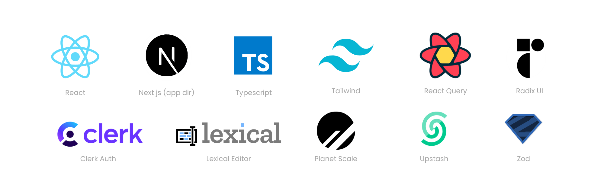

<h1 align="center">Tasks Board App Created With Next.js 14.1 (app dir) + React 18</h1>



## Features

- Written in modern React
- Uses Next js 14.1 app directory structure
- Explores basic React Server Components
- Full user authentication lifecycle with Next-Auth v5
- Modern data fetching using React-Query
- Simple local React state management, without redux, mobx, or similar
- Uses Tailwind for styling
- Uses Prisma ORM for database modeling
- Entire app written with typescript
- End to end type safety with Zod

## Setting up development environment

- Project uses Prisma, you can decide which database to use. \*By default it uses the 'mongodb' provider
- `git clone [repo url]`
- Create an empty `.env` file inside the root dir `/`, copy `env/.env.example` contents into it, and fill in the variables needed.
- `npm install`
- `npx prisma db seed`
- Lookup 'USE THIS IF RUNNING LOCALLY' inside the project and follow the instructions.
- `npm run dev`
- App should now be running on `http://localhost:3000/`

## Next.js 14.1

This is a [Next.js](https://nextjs.org/) project bootstrapped with [`create-next-app`](https://github.com/vercel/next.js/tree/canary/packages/create-next-app).

## Getting Started

First, run the development server:

```bash
npm run dev
# or
yarn dev
# or
pnpm dev
# or
bun dev
```

Open [http://localhost:3000](http://localhost:3000) with your browser to see the result.

You can start editing the page by modifying `app/page.tsx`. The page auto-updates as you edit the file.

This project uses [`next/font`](https://nextjs.org/docs/basic-features/font-optimization) to automatically optimize and load Inter, a custom Google Font.

## Learn More

To learn more about Next.js, take a look at the following resources:

- [Next.js Documentation](https://nextjs.org/docs) - learn about Next.js features and API.
- [Learn Next.js](https://nextjs.org/learn) - an interactive Next.js tutorial.

You can check out [the Next.js GitHub repository](https://github.com/vercel/next.js/) - your feedback and contributions are welcome!

## Deploy on Vercel

The easiest way to deploy your Next.js app is to use the [Vercel Platform](https://vercel.com/new?utm_medium=default-template&filter=next.js&utm_source=create-next-app&utm_campaign=create-next-app-readme) from the creators of Next.js.

Check out our [Next.js deployment documentation](https://nextjs.org/docs/deployment) for more details.

## Author

Furqan Khan

Software Developer / Solution Architect

furqan.cloud.dev@gmail.com
